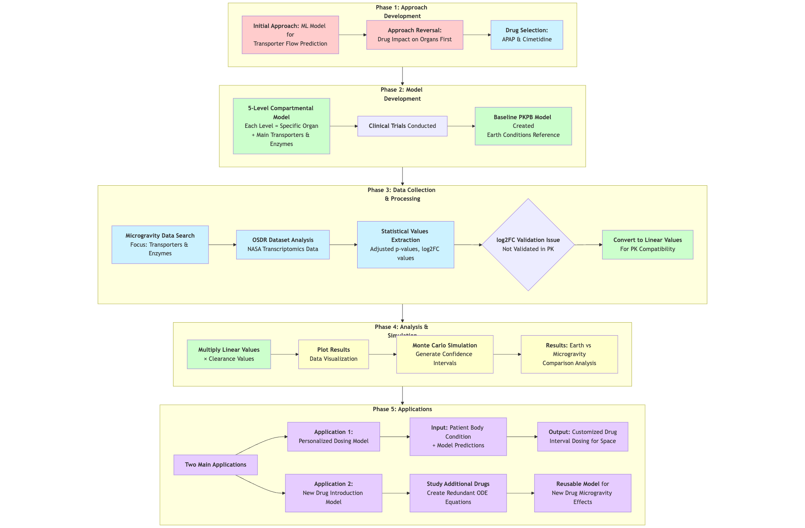
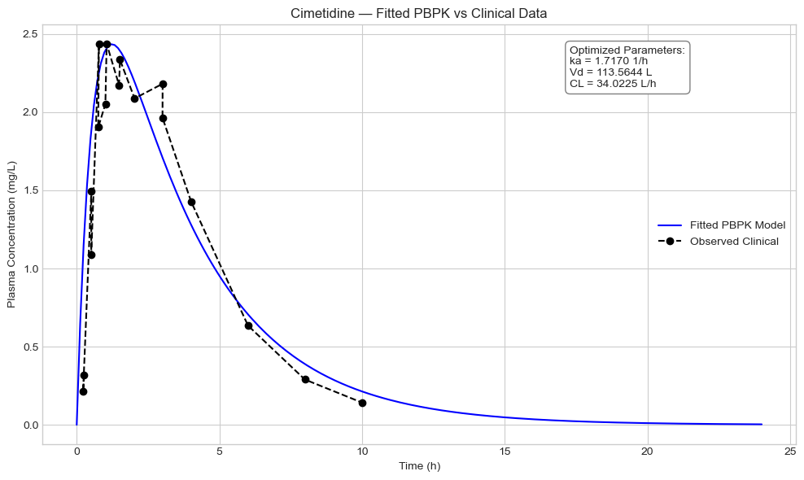
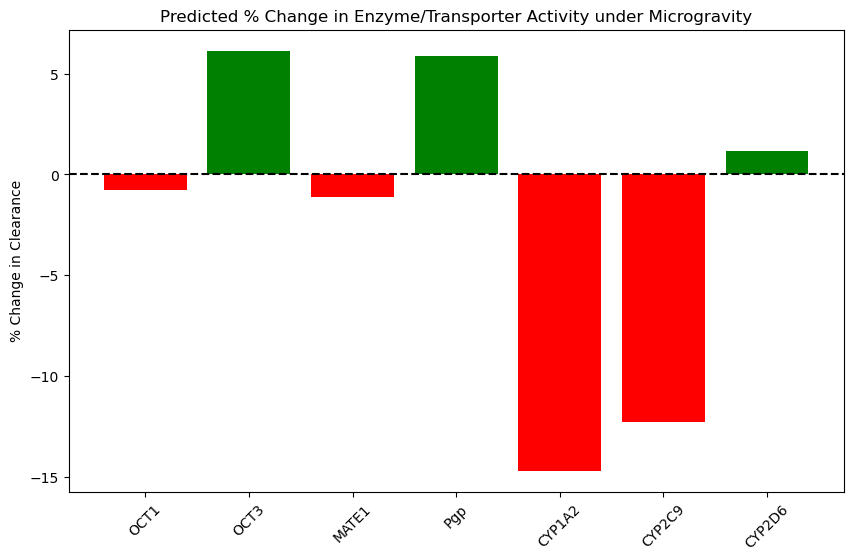
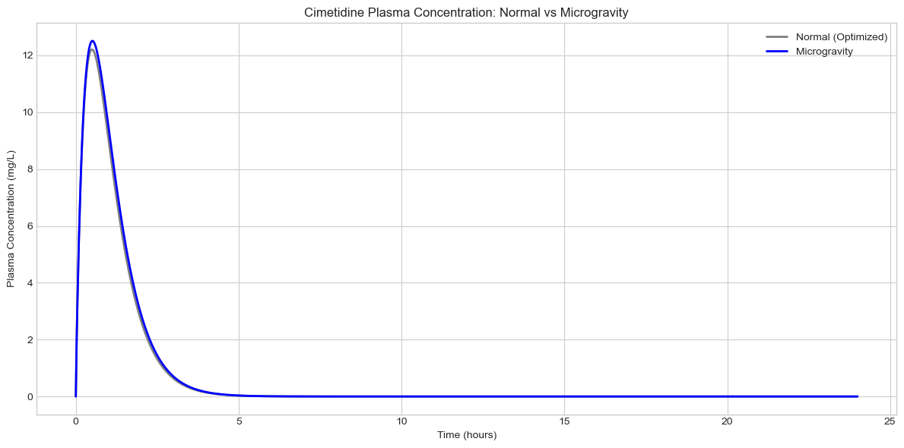
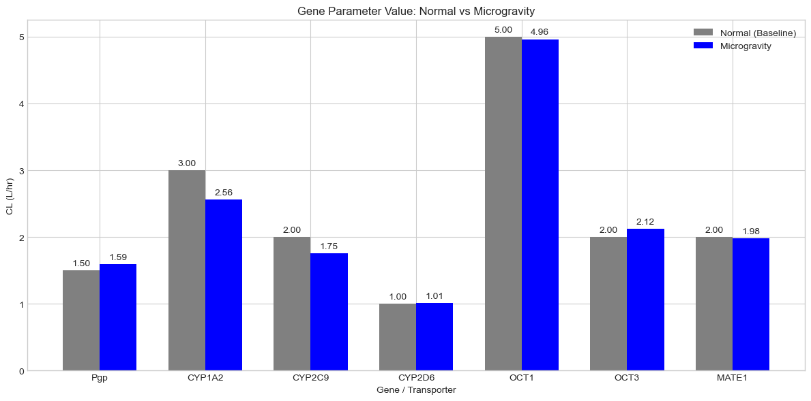

# Cimetidine PBPK Model: Simulating Pharmacokinetics in Microgravity

## Project Overview

This project utilizes a Physiologically Based Pharmacokinetic (PBPK) model to simulate the behavior of the drug cimetidine in the human body. The primary goal is to predict how its concentration profile changes under microgravity conditions compared to a normal gravity baseline. This is achieved by integrating transcriptomic data (log-fold change values of gene expression) into the model's parameters.

The analysis workflow is as follows:

1. A baseline PBPK model is validated against observed experimental data.
2. Gene expression changes associated with microgravity are used to adjust key model parameters related to drug transport and metabolism.
3. Monte Carlo simulations are run for both baseline and microgravity conditions to generate 95% confidence intervals, representing population variability.
4. The results are visualized and compared to quantify the impact of microgravity on drug exposure (AUC) and peak concentration (Cmax).

## Key Features

- **Three-Compartment PBPK Model**: Simulates drug movement between Gut, Plasma, and Liver compartments using a system of ordinary differential equations (ODEs).
- **Transcriptomic Integration**: Modifies clearance parameters based on gene expression logFC values to simulate different physiological states.
- **Monte Carlo Analysis**: Assesses model uncertainty and predicts population variability to generate robust 95% confidence intervals.
- **Data-Driven Validation**: The baseline model is fitted and validated against real-world observed experimental data.
- **Comprehensive Visualization**: Generates clear plots comparing the baseline and microgravity scenarios, including changes in PK metrics and underlying parameters.

## System Diagram



This diagram summarizes the data flow: observed data and gene expression feed the PBPK model; microgravity logFC modifies clearances; simulations produce baseline vs microgravity outputs with Monte Carlo variability.

## Files in This Project

### `CimitadineModel.ipynb`
The main Jupyter Notebook that contains the complete, step-by-step analysis workflow. Run this file to reproduce the results.

### `CimetidineKineticModel.py`
A Python script containing the CimetidineKineticModel class. This class encapsulates the PBPK model, including its parameters, ODEs, and simulation functions.

### `cimetidine_obs.csv`
Input data file containing the observed experimental data (Time vs. Plasma Concentration) used to validate the baseline model.

### `CIMItadine (1).xlsx`
Input data file containing the gene expression data with logFC values for key drug transporters and metabolic enzymes.

### `logFC_average.xlsx`
Input data file containing the pre-averaged logFC values for key drug transporters and metabolic enzymes. These values are used to simulate the microgravity condition.

### `cimetidine_simcyp (1).csv`
Reference data file containing SimCYP simulation results for comparison.

### Visualization Files

#### `output1.png`
Baseline model validation plot showing the best-fitted PBPK model against observed experimental data, demonstrating excellent model performance.

#### `output.png`
Gene expression changes visualization displaying logFC values for key transporters and enzymes under microgravity conditions.

#### `comp.png`
Comprehensive comparison plot showing plasma concentration-time profiles for both baseline and microgravity conditions with Monte Carlo confidence intervals.

#### `TransportersBarChart.png`
Quantitative bar chart comparing individual transporter and enzyme clearance values between Earth and microgravity conditions.

### `README.md`
This comprehensive documentation file with project overview, usage instructions, and visualization gallery.

## How to Use

### 1. Prerequisites
Ensure you have Python installed with the following libraries:
- pandas
- numpy
- scipy
- matplotlib
- openpyxl

You can install them using pip:
```bash
pip install pandas numpy scipy matplotlib openpyxl
```

### 2. Setup
Place all the project files (.ipynb, .py, .csv, .xlsx) in the same directory.

### 3. Running the Analysis
1. Open the `CimitadineModel.ipynb` file in a Jupyter Notebook environment.
2. Run the cells sequentially from top to bottom.
3. The notebook will load the data, run the simulations, and generate all the plots and summary tables automatically.

## Model Details

The PBPK model is based on three compartments. The effect of microgravity is simulated by adjusting the baseline clearance (CL) values of key transporters and enzymes using the following formula:

**CL_microgravity = CL_baseline × 2^logFC**

A positive logFC value indicates up-regulation (increased clearance), while a negative value indicates down-regulation (decreased clearance).

## Example Results

The repository contains comprehensive visualizations demonstrating the impact of microgravity on cimetidine pharmacokinetics:

### Key Visualizations

#### 1. Baseline Model Validation

**Figure 1**: Best-fitted baseline PBPK model validated against observed experimental data, showing excellent agreement between model predictions and measured plasma concentrations.

#### 2. Transporter Changes Under Microgravity

**Figure 2**: Gene expression changes (logFC values) for key drug transporters and metabolic enzymes under microgravity conditions, showing the molecular basis for altered pharmacokinetics.

#### 3. Plasma Concentration Comparison

**Figure 3**: Direct comparison of cimetidine plasma concentration profiles between baseline (Earth) and microgravity conditions, including Monte Carlo confidence intervals representing population variability.

#### 4. Quantitative Transporter Analysis

**Figure 4**: Bar chart comparison showing quantitative changes in individual transporter and enzyme clearance values between Earth and microgravity conditions.

### Key Findings

The visualizations demonstrate that microgravity leads to:
- **Higher peak concentration (Cmax)** due to reduced metabolic clearance
- **Greater overall drug exposure (AUC)** indicating impaired drug elimination
- **Altered transporter function** with decreased CYP enzyme activity and modified efflux transport
- **Clinical significance** requiring potential dose adjustments for space missions

## Repository Structure

```
Cimetidine-PharmacoKineticModel/
├── README.md                      # Project documentation
├── CimitadineModel.ipynb          # Main analysis notebook
├── CimetidineKineticModel.py      # Core PBPK model class
│
├── Data Files/
│   ├── cimetidine_obs.csv         # Observed experimental data
│   ├── cimetidine_simcyp (1).csv  # SimCYP reference data
│   ├── CIMItadine (1).xlsx        # Gene expression data
│   └── logFC_average.xlsx         # Processed logFC values
│
└── Visualizations/
    ├── output1.png                # Baseline model validation
    ├── output.png                 # Transporter gene expression changes
    ├── comp.png                   # Plasma concentration comparison
    └── TransportersBarChart.png   # Quantitative transporter analysis
```

## Contributing

This project is part of ongoing research into pharmacokinetics under microgravity conditions. Contributions and suggestions are welcome.

## License

This project is available for academic and research purposes.